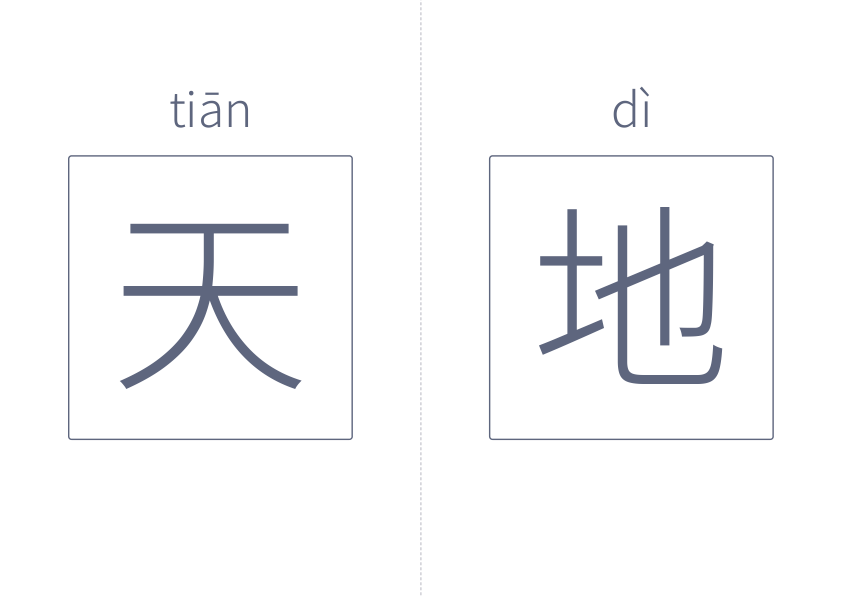

<h1 align="center">汉字卡</h1>

<p align="center">
  
  <a href="../LICENSE"></a>
  
</p>

<p align="center"><a href="../README.md">返回项目首页</a></p>

<p align="center">
  <a href="../examples/hanzi-card/hanzi-card.pdf">
    
  </a>
</p>

汉字卡将内置的 300 字排成一套大字卡片，每页两个字，默认带拼音。
打印后可以用于亲子认读、课堂展示，或沿中间虚线裁开，做成可以逐张抽取、排列组词的卡片。

运行一条命令就能得到排好版的 A4 横向 PDF，不用另找字表、逐个标注拼音或安排分页。
方框在各自半页内居中，拼音位于方框上方。需要针对几个生字练习时，也可以输入自己的文字。

<p align="center">
  示例 PDF 文件：<a href="../examples/hanzi-card/hanzi-card.pdf">汉字卡打印版</a>
  <br>下载：<a href="https://github.com/namishu/printables/releases/latest/download/hanzi-card.pdf">完整 300 字汉字卡</a>
</p>

示例包含“天地”两个字，共一页。打印后沿中间虚线裁开即可得到两张字卡。

## 快速开始

生成整套汉字卡：

```bash
namishu-printables hanzi-card
```

生成一个包含 300 字、共 150 页的 `hanzi-card.pdf`，保存在运行命令的当前目录，默认自动标注拼音。
内置字表随安装包提供，无需准备文本文件；打印时可以选择需要的页面。
字表保留既定顺序和重复字，作为认读素材使用，不表示教学顺序。

## 其他命令

只打印几个生字时，直接输入文字：

```bash
namishu-printables hanzi-card "天地玄黄"
```

这会生成一个两页的 PDF。每页两个字；只有一个字或最后剩一个字时，放在左半页，右半页留空。
自定义输入保留顺序和重复字，忽略标点、空格、换行、数字等非汉字内容，默认每次最多 300 字。

不显示拼音，用于看字认读：

```bash
namishu-printables hanzi-card "天地玄黄" --no-pinyin
```

多音字可以手动指定读音，每个字对应一个音节，以空格分隔。声调可以直接用数字输入：

```bash
namishu-printables hanzi-card "重庆" --pinyin "chong2 qing4"
```

PDF 中会显示为 `chóng qìng`。数字 `1`～`4` 表示一至四声，`0` 或 `5` 表示轻声；
`ü` 可以写成 `v` 或 `u:`，例如 `lv4`、`lu:4` 都会显示为 `lǜ`。
也可以直接输入或粘贴带声调的拼音，如 `--pinyin "chóng qìng"`。

只想指定某一个字时，在这个字后紧接方括号，其余字仍自动标注：

```bash
namishu-printables hanzi-card "重[chong2]庆"
```

注音只作用于当前这个字，同一个字在其他位置可以使用不同读音。

字数较多时，可以把汉字保存在 UTF-8 文本文件中，再指定文件路径：

```bash
namishu-printables hanzi-card --file examples/hanzi-card/quick-start.txt
```

[示例文本](../examples/hanzi-card/quick-start.txt)含 8 个字，生成一个 4 页 PDF。
该文件位于项目的 `examples/hanzi-card/` 目录，可以换成自己的生字表。
文本中的换行不影响分页。

文本文件同样支持局部注音。例如，将以下内容保存为 `words.txt`：

```text
重[chong2]庆
重[zhong4]量
```

```bash
namishu-printables hanzi-card --file words.txt
```

这会生成“重庆”和“重量”两页字卡，两个“重”分别显示 `chóng` 和 `zhòng`。
可以参考[局部注音示例](../examples/hanzi-card/annotated.txt)。方括号中的内容不会作为汉字打印，
也不计入字数上限；使用 `--no-pinyin` 时仍可读取同一文件，只显示汉字。

保存到指定位置：

```bash
namishu-printables hanzi-card "天地玄黄" -o cards/characters.pdf
```

生成完成后，命令会显示保存位置、汉字数量和页数。相对路径以当前目录为准，
不存在的输出目录会自动创建。生成成功后替换同名文件；需要保留不同生字表时，指定不同文件名即可。

## 命令行选项

| 选项 | 用途 | 默认值 |
| --- | --- | --- |
| `TEXT` | 自定义汉字，支持 `字[zi4]` 注音 | 未指定文字或文件时使用内置 300 字 |
| `--file PATH` | 从 UTF-8 文本文件读取汉字 | 与直接输入文字二选一 |
| `--no-pinyin` | 不显示拼音 | 显示拼音 |
| `--pinyin TEXT` | 逐字指定读音，支持数字声调或声调符号 | 自动标注 |
| `--config PATH` | 使用自定义 YAML 配置 | 内置设置 |
| `-o, --output PATH` | PDF 保存路径 | 当前目录下的 `hanzi-card.pdf` |
| `--help` | 查看使用说明 | |
| `--version` | 查看已安装版本 | |

`--pinyin` 的音节数量须与去除非汉字内容后的字数一致，不能与 `--no-pinyin` 或方括号注音同时使用。
局部注音须紧跟汉字，使用英文方括号，每对括号内填写一个音节。注音格式错误会报错。
文件支持带 BOM 的 UTF-8 编码；繁体字可以保留，但字体必须包含相应字形。

## 自定义卡片

方框默认边长为 100 毫米，允许 80～120 毫米。调整大小时，只需将以下内容保存为 `design.yaml`：

```yaml
card:
  size_mm: 90
```

```bash
namishu-printables hanzi-card --config design.yaml
```

汉字字号、拼音字号、方框内边距和拼音间距会随方框大小等比例缩放。
方框保持在所属半页内水平、垂直居中，不需要设置卡片间距。

未填写的设置保留默认值。下载[完整示例配置](../examples/hanzi-card/design.yaml)，
可以查看和修改方框样式、文字颜色、拼音和分隔线设置。

| 设置 | 修改位置 |
| --- | --- |
| 方框边长 | `card.size_mm`，单位为毫米，允许 80～120 |
| 方框内边距 | `card.padding_mm` |
| 方框粗细、圆角与颜色 | `card.border_width_pt`、`border_radius_mm` 和 `border_color` |
| 汉字字号与颜色 | `hanzi.font_size_pt` 和 `color` |
| 拼音字号、颜色及与方框的距离 | `pinyin.font_size_pt`、`color` 和 `gap_mm` |
| 页面中间的分隔线 | `separator`：显示、粗细、颜色和虚线样式 |
| 自定义输入的汉字上限 | `input.max_characters`，默认 300；不限制内置字表 |
| 页面尺寸 | `layout.width_mm` 和 `height_mm` |
| 汉字与拼音字体 | `fonts.hanzi` 和 `fonts.pinyin` |

配置中的字号、内边距和拼音间距以 100 毫米方框为基准。
默认汉字字号为 200 磅，拼音为 48 磅；尺寸和间距单位为毫米，字号和线宽单位为磅。
颜色使用加引号的十六进制值，如 `"#5f667e"`。

自定义字体路径相对于 YAML 文件，也可以使用绝对路径。未指定时使用内置字体，
字体会嵌入 PDF，接收者无需安装。
设置无效、字体缺字或内容放不下时，命令会报错，并保留已有 PDF。
