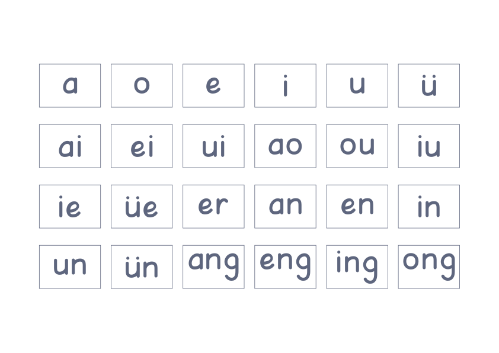

<h1 align="center">拼音表</h1>

<p align="center">
  
  <a href="../LICENSE"></a>
  
</p>

<p align="center"><a href="../README.md">返回项目首页</a></p>

<p align="center">
  <a href="../examples/pinyin-chart/pinyin-chart.pdf">
    
  </a>
</p>

拼音表将声母、韵母和整体认读音节分别排成一页 A4 横向 PDF，适合放在书桌旁做认读参考，
也适合亲子指读、课堂领读和拼读练习。

内容和版式已经准备好，不需要逐个输入拼音、寻找合适字体或手动排版。
每页拼音使用统一字号，每项拼音使用独立边框，文字在框内居中。
声母使用正方框，韵母和整体认读音节使用横向长方框。
内置宝宝字帖拼音常规体，字形圆润，包含拼音声调字符。

<p align="center">
  示例 PDF 文件：<a href="../examples/pinyin-chart/pinyin-chart.pdf">整套拼音表</a>
</p>

示例包含三页，依次为声母、韵母和整体认读音节；预览图展示其中的韵母页。
可以直接下载打印。

## 快速开始

生成整套拼音表：

```bash
namishu-printables pinyin-chart
```

得到一个三页的 `pinyin-chart-all.pdf`，保存在运行命令的当前目录。
每类拼音独立占一页，可以一次打印整套，也可以在打印时只选择需要的页面。

## 其他命令

如果只需要一页，可以指定声母、韵母或整体认读音节：

```bash
namishu-printables pinyin-chart shengmu
namishu-printables pinyin-chart yunmu
namishu-printables pinyin-chart yinjie
```

| 类型 | 内容 | 默认输出文件 | 页数 |
| --- | --- | --- | --- |
| `shengmu` | 声母页，23 项，包含 y、w | `pinyin-chart-shengmu.pdf` | 1 |
| `yunmu` | 韵母，24 项 | `pinyin-chart-yunmu.pdf` | 1 |
| `yinjie` | 整体认读音节，16 项 | `pinyin-chart-yinjie.pdf` | 1 |
| 不指定类别 | 以上三类，按表中顺序排列 | `pinyin-chart-all.pdf` | 3 |

默认声母、韵母各排成四行六列，整体认读音节排成四行四列，内容和顺序固定。
每页列数可以独立配置，行数根据内容自动计算。
三页均按实际字形在各自方框内水平、垂直居中。声母最后一行有五项，与上方五列对齐。
列间距、行间距固定，整组文字在页边距范围内水平、垂直居中。

## 命令行选项

| 选项 | 用途 | 默认值 |
| --- | --- | --- |
| `--config PATH` | 使用自定义 YAML 配置 | 内置设置 |
| `-o, --output PATH` | PDF 保存路径 | 当前目录下对应类别的文件名 |
| `--help` | 查看使用说明 | |
| `--version` | 查看已安装版本 | |

例如，保存到指定目录：

```bash
namishu-printables pinyin-chart -o cards/pinyin.pdf
```

完成后会显示保存位置、页数和各页拼音数量。相对路径以当前目录为准，
不存在的输出目录会自动创建。生成成功后替换同名文件；需要保留不同版本时，指定不同文件名即可。

## 自定义版式

将想修改的设置保存为 `design.yaml`：

```yaml
layout:
  margin_top_mm: 20
  margin_bottom_mm: 20
  margin_left_mm: 20
  margin_right_mm: 20
grid:
  column_gap_mm: 6
categories:
  shengmu:
    grid:
      columns: 6
      row_gap_mm: 8
    content:
      font_size_pt: 96
```

```bash
namishu-printables pinyin-chart --config design.yaml
```

未填写的设置保留默认值，也可以下载[完整示例配置](../examples/pinyin-chart/design.yaml)修改。

| 设置 | 修改位置 | 默认值 |
| --- | --- | --- |
| 四边页边距 | `layout.margin_top_mm`、`margin_bottom_mm`、`margin_left_mm`、`margin_right_mm` | 各 20 mm |
| 列数 | `grid.columns` | 声母、韵母 6 列，整体认读音节 4 列 |
| 字号 | `content.font_size_pt` | 声母 96 pt、韵母 64 pt、整体认读音节 80 pt |
| 列间距 | `grid.column_gap_mm` | 6 mm |
| 行间距 | `grid.row_gap_mm` | 声母 8 mm，其余 10 mm |
| 边框开关 | `card.enabled` | `true` |
| 边框形状 | `card.shape` | 声母 `square`，其余 `rectangle` |
| 内边距 | `card.padding_mm` | 3 mm |
| 边框粗细 | `card.border_width_pt` | 0.8 pt |
| 边框颜色 | `card.border_color` | `"#5f667e"` |
| 文字颜色 | `content.color` | `"#5f667e"` |
| 纸张宽高 | `layout.width_mm`、`height_mm` | 297 × 210 mm |
| 拼音字体 | `fonts.content` | `bundled` |

每页独立设置列数、字号和行距，页内字号一致，不随拼音长度缩放。单独生成某一类时，版式与整套 PDF 中对应页面相同。

| 页面 | 列数 | 字号 | 行间空隙 |
| --- | --- | --- | --- |
| 声母 | 6 | 96 pt | 8 mm |
| 韵母 | 6 | 64 pt | 10 mm |
| 整体认读音节 | 4 | 80 pt | 10 mm |

[查看声母页预览](../examples/pinyin-chart/shengmu.png) · [下载声母页 PDF](../examples/pinyin-chart/shengmu.pdf)。
每项拼音一个方框，`zh`、`ang`、`yuan` 等均各占一个框。三页内边距均为 3 mm，框间水平间距均为 6 mm。
[韵母页预览](../examples/pinyin-chart/yunmu.png) · [整体认读音节页预览](../examples/pinyin-chart/yinjie.png)。
可在通用 `card` 或各页的 `categories.<类别>.card` 中调整 `padding_mm`、`border_width_pt` 和 `border_color`。
`padding_mm` 是字形与边框内沿之间的最小留白，四边共用一个数值，默认 3 mm。
`card.shape` 可设为 `square`（正方形）或 `rectangle`（长方形）；宽高根据本页字形、字号和内边距自动计算，同页边框尺寸一致。
内置配置见 [defualt.yaml](../src/namishu_printables/pinyin_chart/config/defualt.yaml)。

行列间距表示相邻边框外沿之间的空隙。将 `card.enabled` 设为 `false` 可以隐藏边框，
文字的位置、字号和间距保持不变。

列数须为正整数，行数自动计算；列数超过内容数量时，只排列实际存在的卡片。
最后一行不足时与上方各列对齐。字号、列数或间距导致内容超出页面时，会提示调整配置。

自定义文件中的通用 `grid`、`content` 设置适用于所有页面；同一文件的 `categories` 设置优先于通用设置。

颜色使用加引号的十六进制值，如 `"#5f667e"`。尺寸和间距单位为毫米，字号单位为磅。
自定义字体路径相对于 YAML 文件，也可以使用绝对路径；字体嵌入 PDF，接收者无需安装。
内置字体的来源与许可见[字体说明](../src/namishu_printables/assets/fonts/README.md)。
