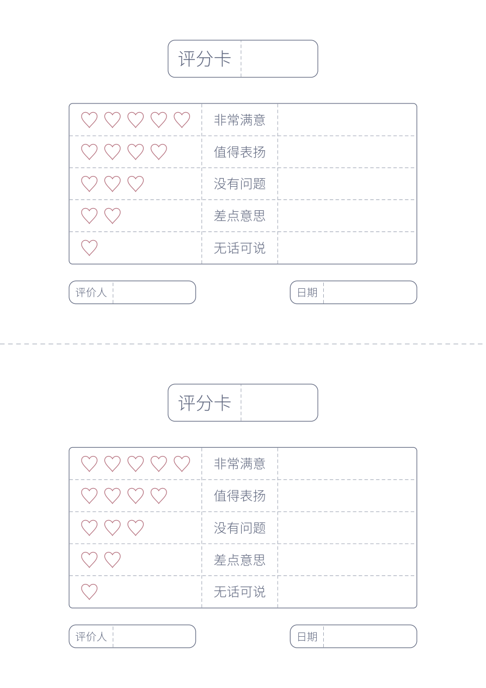

<h1 align="center">评分卡</h1>

<p align="center">
  
  <a href="../LICENSE"></a>
  
</p>

<p align="center"><a href="../README.md">返回项目首页</a></p>

<p align="center">
  <a href="../examples/rating-card/rating-card.pdf"></a>
</p>

给爸爸、妈妈打个分，也看看他们会给自己几颗爱心！评分卡是一个可以全家一起玩的互评小游戏：选一档评价，涂上爱心，写点想说的话，再交换卡片，看看彼此的选择会不会让人意外。

可以认真写，也可以带一点幽默。先轻松地玩起来，再聊聊“为什么这样选”，也许就能听到一些平时没说出口的想法。

建议父母和孩子同时互评，也可以每周或每月找一个大家都放松的时间做一次。一张 A4 纸上有两张相同的卡片，沿中间虚线剪开即可使用。

<p align="center">
  示例 PDF 文件：<a href="../examples/rating-card/rating-card.pdf">评分卡打印版</a>
</p>

## 填写方法

先各自填写，留一点悬念，等大家写完再一起交换。可以一起选一个主题，比如“最近相处得怎么样”或“有没有认真听对方说话”；也可以不设主题，凭当下的感觉来选。没有标准答案，不需要为打高分或低分感到压力。

1. **填写被评价的人。** 在顶部“评分卡”文字右边的空白处，写上这张卡要评谁。可以写“爸爸”“妈妈”，也可以写孩子的昵称或名字。
2. **选择一档评价。** 从表格的五行中选一行，涂满第一列中这一行的爱心。第二列是对应的描述，按自己的理解选择即可。
3. **写下想说的话。** 第三列可以自由书写，例如选择这一档的理由、让你开心或委屈的一件事，或者一句平时没说出口的话。不必每格都写满，也可以留到交换卡片时再说。
4. **填写评价人和日期。** 底部“评价人”写填写这张卡的人，再记下日期。例如孩子给妈妈评分，顶部写“妈妈”，底部写孩子的名字。

## 交流与倾听

填完后交换卡片，可以从一句“你为什么这样选？”开始。给对方时间讲完，也可以接着问：“你想到的是哪件事？”“那时候你是什么感受？”分数和文字只是一个开头，更值得听的是它们背后的经历。

看看自己的想法与对方的感受有没有不同：我眼中的自己，和别人眼中的我，是否一样？比如父母觉得自己在关心孩子，孩子却可能感到被催促；把这两种理解说出来，才有机会知道彼此心里在想什么。

对父母来说，尤其值得借这个机会站在孩子的角度听一听。即使收到的评价出乎意料，也先了解孩子为什么会这样感受。不要因为分数低而批评孩子，也不要借着自己给孩子的评价提要求、讲道理。让孩子知道，他可以坦诚表达，不必担心说完之后受到责备。

不必当场争出谁对谁错，也不必要求对方马上改变。一次交流能够让彼此多说一点、多理解一点，就已经有意义。定期互评时，也可以回看以前的卡片，聊聊最近的感受有没有变化。

## 快速开始

```bash
namishu-printables rating-card
```

在当前目录生成一页 `rating-card.pdf`，包含两张空白评分卡。姓名、留言、评价人和日期均手写填写。

## 其他命令

指定输出文件：

```bash
namishu-printables rating-card -o cards/score.pdf
```

修改评分文字或版式：

```bash
namishu-printables rating-card --config design.yaml
```

## 配置

默认配置文件为 `default.yaml`。[完整配置](../examples/rating-card/design.yaml)列出全部默认值，只需在自己的 YAML 中填写要修改的项目。

例如调整评分文字和单元格留白：

```yaml
table:
  labels:
    five: 非常满意
    four: 值得表扬
    three: 没有问题
    two: 差点意思
    one: 无话可说
  padding:
    left_mm: 5
    right_mm: 5
    top_mm: 3.3
    bottom_mm: 3.3
```

### 页面与间距

| 配置 | 用途与默认值 |
| --- | --- |
| `page.width_mm` / `height_mm` | 页面尺寸，210 × 297 mm |
| `page.margin_left_mm` / `margin_right_mm` | 左右最小留白，各 15 mm |
| `page.margin_top_mm` / `margin_bottom_mm` | 每个半页的上下最小留白，各 12 mm |
| `layout.title_gap_mm` | 顶部标题标签与表格之间的距离，11 mm |
| `layout.footer_gap_mm` | 表格与底部标签之间的距离，7 mm |
| `layout.footer_min_gap_mm` | 两个底部标签之间至少保留的距离，5 mm |

整组内容在各自半页的可用区域内水平、垂直居中。内容尺寸小于可用区域时，实际页面留白会大于配置的最小值。

### 标题与底部标签

`title` 控制顶部评分卡标签，`footer` 控制底部评价人、日期标签。两部分可分别设置：

| 字段 | 标题默认值 | 底部默认值 |
| --- | --- | --- |
| `width_mm` | 65 mm | 每张 55 mm |
| `font_size_pt` | 22 pt | 13 pt |
| `color` | `"#5f667e"` | `"#5f667e"` |
| `padding.left_mm` / `right_mm` | 各 4 mm | 各 2.5 mm |
| `padding.top_mm` / `bottom_mm` | 各 4 mm | 各 2.5 mm |
| `blank_min_width_mm` | 至少保留 20 mm 净书写宽度 | 至少保留 20 mm 净书写宽度 |
| `border.radius_mm` | 3 mm | 3 mm |

标题文字通过 `title.text` 设置，默认为“评分卡”；底部文字通过 `footer.reviewer`、`footer.date` 设置，默认为“评价人”“日期”。顶部标签居中，底部两张标签分别靠左、靠右，高度按各自字号和上下内边距计算。

### 表格与爱心

| 配置 | 用途与默认值 |
| --- | --- |
| `table.labels` | `five`、`four`、`three`、`two`、`one` 分别对应五颗至一颗爱心的描述 |
| `table.font_size_pt` / `color` | 描述字号 16 pt，颜色 `"#5f667e"` |
| `table.padding.left_mm` / `right_mm` | 前两列的左右内边距，各 5 mm |
| `table.padding.top_mm` / `bottom_mm` | 每行的上下内边距，各 3.3 mm |
| `table.border.radius_mm` | 表格圆角半径，1.5 mm |
| `heart.size_mm` | 爱心大小，7 mm |
| `heart.gap_mm` | 相邻爱心之间的间距，3 mm |
| `heart.width_pt` / `color` | 爱心线宽 0.8 pt，颜色 `"#b46b7a"` |
| `writing.width_mm` | 第三列空白书写区域宽度，60 mm |

五行始终等高。行高由文字或爱心的最大高度、上下内边距及分隔线线宽共同确定；上下内边距相等时，文字和爱心在行内垂直居中。无需另设行距。

第一列按五颗爱心及其间距自动计算宽度，第二列按最长描述计算宽度，两列分别加上左右内边距。第三列直接设置书写宽度。表格不另设列距，调整左右内边距即可改变内容与分隔线之间的距离。

### 边框与分隔线

标题、表格、底部标签的外边框分别由 `title.border`、`table.border`、`footer.border` 设置。它们使用相同的字段：`width_pt` 为线宽，`color` 为颜色，`radius_mm` 为圆角。默认线宽均为 0.8 pt，颜色均为 `"#5f667e"`；每部分可独立修改。

虚线按位置分别配置：

| 配置 | 对应线条 |
| --- | --- |
| `title.separator` | 顶部标签内的竖向分隔线 |
| `table.horizontal` | 表格内的四条横线 |
| `table.vertical` | 表格内的两条竖线 |
| `footer.separator` | 底部标签内的竖向分隔线 |
| `page.cut` | 页面中间贯穿纸张的裁剪线 |

这些位置均使用 `width_pt`、`color`、`dash_length_mm`、`dash_gap_mm` 四个字段。默认线宽 0.6 pt、颜色 `"#9299ab"`；分隔线的虚线长度为 1.5 mm、间隔为 1 mm，裁剪线分别为 2 mm、1.5 mm。

例如单独调整表格内的虚线：

```yaml
table:
  horizontal:
    width_pt: 0.5
    color: "#a0a5b0"
  vertical:
    dash_length_mm: 2
    dash_gap_mm: 1.5
```

### 字体

`fonts.content` 默认使用内置字体 `bundled`。自定义字体路径相对 YAML 所在目录。

内容放不下时会提示调整配置，不会截断文字或缩小字号；生成失败时保留已有 PDF。
