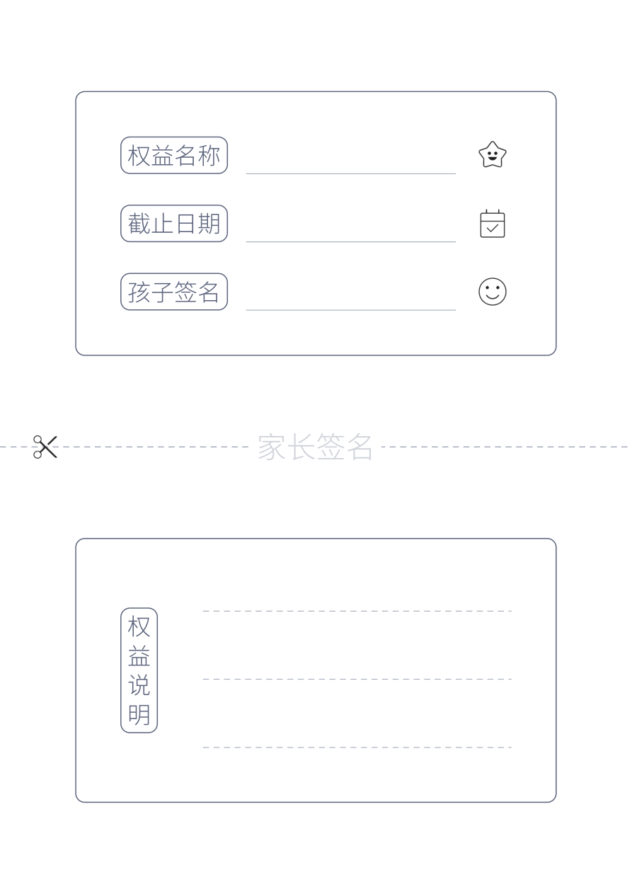

<h1 align="center">权益卡</h1>

<p align="center">
  
  <a href="../LICENSE"></a>
  
</p>

<p align="center"><a href="../README.md">返回项目首页</a></p>

<p align="center">
  <a href="../examples/reward-card/reward-card.pdf">
    
  </a>
</p>

家长答应孩子的事，最好一起写下来。大人可能忙过头忘了，孩子也可能记错细节；把约定落到纸上，双方就有了共同的依据，减少误会，也在一次次兑现承诺中建立信任。

权益卡适合记录一次外出、一段游戏时间、一个小愿望，或完成任务后的奖励。一张 A4 纵向纸分为上下两张卡片，孩子保管上卡，家长保留下卡，方便日后核对和兑现。

<p align="center">
  示例 PDF 文件：<a href="../examples/reward-card/reward-card.pdf">权益卡打印版</a>
</p>

## 使用说明

1. **一起写清约定。** 上卡填写权益名称、截止日期，并请孩子签名。下卡填写具体说明，例如达到什么条件后可以兑现、可以使用几次，以及需要提前商量的事项。发卡前一起确认，避免对同一项约定产生不同理解。
2. **签名后剪开发放。** 家长在页面中间的虚线处签名，让笔迹跨过裁剪线，再沿虚线剪开。上卡交给孩子，下卡由家长留底。两半签名可以拼合核对，也能起到一定的防伪作用。
3. **兑现后回收留念。** 孩子凭上卡兑现权益，家长可对照留底的说明核对约定。兑现后收回上卡，避免重复使用；两张卡片也可以一起保存，作为亲子约定和成长的纪念。

## 快速开始

```bash
namishu-printables reward-card
```

生成一页 `reward-card.pdf`，保存在当前目录。填写后沿页面中央虚线剪开。

## 其他命令

指定输出文件：

```bash
namishu-printables reward-card -o reward.pdf
```

使用自定义配置：

```bash
namishu-printables reward-card --config design.yaml
```

## 命令行选项

| 参数 | 用途 |
| --- | --- |
| `--config PATH` | 指定 YAML 配置 |
| `-o, --output PATH` | 指定输出 PDF |
| `--help` | 查看帮助 |
| `--version` | 查看版本 |

## 自定义版式

[完整配置](../examples/reward-card/design.yaml)分为以下部分，只需在自己的 YAML 中填写需要修改的项目。

| 配置 | 用途 |
| --- | --- |
| `layout` | 页面尺寸，以及每个半页的留白 |
| `card` | 两张卡片共用的尺寸和外边框 |
| `title` | 两张卡片共用的标签字号、颜色、边框和内边距 |
| `upper` | 上卡的四边内边距、三个标签及图标、书写线样式 |
| `lower` | 下卡的四边内边距、竖排标签、书写线数量及样式 |
| `cut` | 中间签名字样、剪刀图标及裁剪虚线 |
| `fonts.content` | `bundled` 或相对于 YAML 的字体文件路径 |

例如，修改公共标签样式、上卡内容、下卡内边距和中间签名文字：

```yaml
title:
  font_size_pt: 20
  padding_mm: 3
  color: '#5f667e'
upper:
  fields:
    reward:
      title: 奖励名称
      icon: star
    child:
      title: 领取人
      icon: face
lower:
  padding_left_mm: 12
  padding_right_mm: 12
  title: 使用说明
cut:
  text: 家长签名
  watermark_font_size_pt: 26
```

### 卡片

两张卡片默认均为 160 × 88 mm，分别在各自半页的可用区域内居中。

| 配置 | 默认值 | 用途 |
| --- | --- | --- |
| `layout.width_mm` / `height_mm` | 210 / 297 | 页面宽高 |
| `layout.margin_left_mm` / `margin_right_mm` | 20 / 20 | 左右页边距 |
| `layout.margin_top_mm` / `margin_bottom_mm` | 20 / 20 | 每个半页的上下留白 |
| `card.width_mm` / `height_mm` | 160 / 88 | 两张卡片的外沿尺寸 |
| `card.border_radius_mm` | 3 | 外边框圆角半径 |
| `card.border_width_pt` | 1 | 外边框线宽 |
| `card.border_color` | `#5f667e` | 外边框颜色 |

### 标签

`title` 指卡片内的“权益名称”“截止日期”“孩子签名”和“权益说明”。它们共用一套样式，标签框随文字和内边距自动计算尺寸，上卡的三个标签框保持等宽。

| 配置 | 默认值 | 用途 |
| --- | --- | --- |
| `title.font_size_pt` | 22 | 标签字号 |
| `title.color` | `#5f667e` | 文字颜色 |
| `title.padding_mm` | 2 | 标签文字与边框内沿之间的最小留白 |
| `title.border_radius_mm` | 3 | 标签框圆角半径 |
| `title.border_width_pt` | 1 | 标签框线宽 |
| `title.border_color` | `#5f667e` | 标签框颜色 |

### 上卡

三行在四边内边距限定的区域内均匀排列。每行书写线的下沿固定与左侧标签框的底部对齐，图标高度自动跟随标签框的完整高度（含边框），宽度按原图比例计算，并在该行垂直居中。图片文件自身的透明留白也计入尺寸。

| 配置 | 默认值 | 用途 |
| --- | --- | --- |
| `upper.padding_top_mm` / `padding_bottom_mm` | 10 / 10 | 上下内边距 |
| `upper.padding_left_mm` / `padding_right_mm` | 15 / 15 | 左右内边距 |
| `upper.title_gap_mm` | 6 | 标签框与书写线之间的距离 |
| `upper.icon_gap_mm` | 6 | 书写线与图标之间的距离 |
| `upper.line_width_pt` | 0.6 | 书写实线粗细 |
| `upper.line_color` | `#9299ab` | 书写实线颜色 |

三个字段固定按以下顺序排列，每项分别配置 `title` 和 `icon`：

| 配置 | 默认文字 | 默认图标 |
| --- | --- | --- |
| `upper.fields.reward` | 权益名称 | `star` |
| `upper.fields.expiry` | 截止日期 | `event` |
| `upper.fields.child` | 孩子签名 | `face` |

`icon` 可填写 `star`、`event`、`face`、`cut`，或相对于 YAML 的图片路径，例如 `images/reward.png`。填写 `none` 可隐藏该行图标，并将书写线延长到右侧内边距。

### 下卡

“权益说明”竖排标签在可用区域内垂直居中。书写线从标签框右侧再留出 `lower.padding_left_mm` 的位置开始，与标签左侧到卡片边缘的距离一致。三行默认与上卡采用相同的行间距；修改上下内边距或行数后重新均匀排列。

| 配置 | 默认值 | 用途 |
| --- | --- | --- |
| `lower.padding_top_mm` / `padding_bottom_mm` | 10 / 10 | 上下内边距 |
| `lower.padding_left_mm` / `padding_right_mm` | 15 / 15 | 左右内边距 |
| `lower.title` | 权益说明 | 竖排标签文字 |
| `lower.lines` | 3 | 书写虚线行数 |
| `lower.line_width_pt` | 0.6 | 书写虚线粗细 |
| `lower.line_color` | `#9299ab` | 书写虚线颜色 |

### 裁剪区

裁剪虚线固定在页面中央，延伸至左右边缘。浅色签名字样在中央居中显示，剪刀图标放在左侧。

| 配置 | 默认值 | 用途 |
| --- | --- | --- |
| `cut.text` | 家长签名 | 中间签名文字 |
| `cut.watermark_font_size_pt` | 28 | 签名字号 |
| `cut.watermark_color` | `#d1d4dc` | 签名文字颜色 |
| `cut.icon_inset_mm` | 10 | 剪刀图标距纸张左边缘的距离 |
| `cut.icon_size_mm` | 10 | 剪刀图标尺寸 |
| `cut.line_width_pt` | 0.8 | 裁剪线粗细 |
| `cut.color` | `#9299ab` | 裁剪线颜色 |
| `cut.dash_length_mm` / `dash_gap_mm` | 2 / 1.5 | 虚线线段长度及间隔 |

尺寸和间距使用 mm，字号和线宽使用 pt，颜色使用加引号的 `'#RRGGBB'`。卡片尺寸、标签、图标或书写区超出可用空间时会报错。
