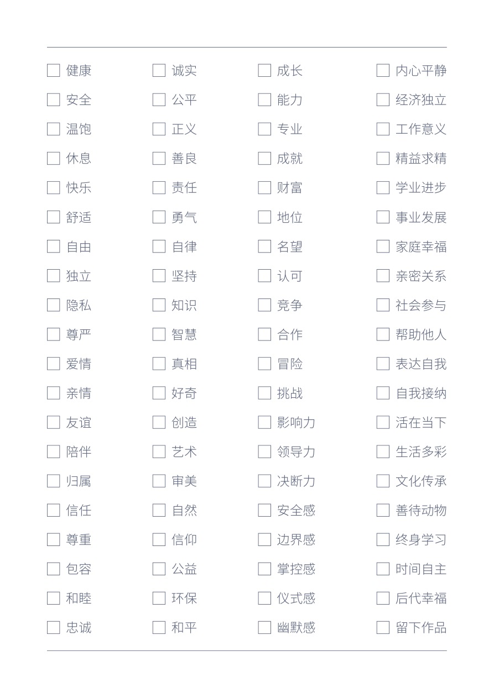

<h1 align="center">价值观探索卡</h1>

<p align="center">
  
  <a href="../LICENSE"></a>
  
</p>

<p align="center"><a href="../README.md">返回项目首页</a></p>

<p align="center">
  <a href="../examples/values-card/values-card.pdf">
    
  </a>
</p>

你现在最在意的是什么？价值观探索卡适合在家庭聚会、朋友聚会时一起使用，也适合独处时留一点时间给自己。通过几轮选择和取舍，看看哪些事情对当下的自己最重要，也为彼此的交流找到一个起点。

一张 A4 纸列出 80 个选项，涵盖生活、关系、成长、成就和社会关怀等方面。每个词都允许有不同的理解，没有标准答案。比如“自由”可以是自己安排时间，也可以是敢于表达想法；选择时，以你自己的理解为准。

<p align="center">
  示例 PDF 文件：<a href="../examples/values-card/values-card.pdf">价值观探索卡打印版</a>
</p>

## 使用方法

每人一张，先独立完成选择。把选择过程控制在 **10 分钟以内**，按当下的想法作答，不必反复寻找一个完美答案。

1. **选 10 项。** 浏览词表，勾出你最在意的 10 项。
2. **留下 5 项。** 只从刚才的 10 项中筛选，在留下的选项旁写上 `5`。
3. **留下 3 项。** 再从这 5 项中选出 3 项，在旁边写上 `3`。
4. **留下 1 项。** 最后从这 3 项中圈出目前最重要的一项。

每一轮都从上一轮的选择中取舍。没有留下的选项也可能很重要，这次选择只是帮助你看清它们在此刻的优先顺序。

## 分享与反思

选择只是第一步。完成后，可以向身边的人分享：你留下了哪些词，怎样理解它们，为什么这样选？哪一次取舍最难？同一个词背后可能是完全不同的经历，听听对方的理由，比比较谁选了什么更有意思。独自使用时，也可以把这些理由简单写下来。

接下来，再看看自己的选择与日常行动是否一致：**如果我重视这些事情，我最近是怎样为它们投入时间、精力和金钱的？** 尽量想一两个具体例子。比如选了“陪伴”，最近有没有专心陪家人吃一顿饭；选了“健康”，自己的睡眠和运动又是什么样的。

如果发现不一致，可以从两个方向继续想。一种是你仍然认同这份追求，那么就为它安排一个具体、可执行的行动，例如这周留一个晚上陪伴家人。另一种是，回看自己的生活后，你发现另一些事情才是目前更在意的，那么也可以调整原来的选择，让目标更贴近自己。

实际行动也会受到现实条件和习惯的影响，不必只凭一次不一致就否定自己的选择。可以问问自己：我想改变的是行动，还是目标？接下来愿意做的一件小事是什么？这些想法也可以继续与家人、朋友交流，过一段时间再回头看看。

## 快速开始

直接生成内置 80 项的价值观探索卡：

```bash
namishu-printables values-card
```

## 其他命令

使用自己的词表，每行一个选项，按文件中的顺序生成：

```bash
namishu-printables values-card --file my-values.txt
```

如果只想修改默认词表中的几项，可以先导出：

```bash
namishu-printables values-card --export-default my-values.txt
```

打开 `my-values.txt`，增删或修改选项，保存后用 `--file my-values.txt` 生成。
导出只写入文本文件，不生成 PDF；如果目标文件已存在，会报错，避免覆盖已修改的词表。

指定配置和 PDF 输出路径：

```bash
namishu-printables values-card --file my-values.txt --config design.yaml -o family.pdf
```

生成卡片时只输出一个 PDF，始终一页。输出默认在运行命令的当前目录：

- 默认选项：`values-card.pdf`。
- 文件输入：`values-card-<输入文件名，不含扩展名>.pdf`。
- `-o` / `--output` 指定完整 PDF 路径。

成功生成后替换同名文件；输入、配置或绘制失败时保留已有文件。

## 自定义选项

使用 UTF-8 文本文件（支持 BOM），每行一个选项：

```text
陪伴
信任
尊重
内心平静
```

忽略空行，去掉每行首尾空白；保留原始顺序、重复项、行内空格和标点。
不解析 Markdown、CSV、注释或逗号分隔列表。控制字符和不可见格式字符会报错。
内置字体不支持的字符会提示更换字体，不会静默遗漏。

默认最多 100 项，每项最多 80 个字符，输入文件最多 65536 字节；可在 YAML 的 `limits` 下修改。
这些是输入上限，不代表任意长度的 100 项都能在一页内排下。
完整默认词表见 [values.txt](../examples/values-card/values.txt)，家庭示例见 [family.txt](../examples/values-card/family.txt)。

## 布局与配置

命令行负责选文件和输出路径，YAML 负责设计、布局与输入限制。
默认配置文件为 `default.yaml`。完整配置见 [design.yaml](../examples/values-card/design.yaml)，只写需要覆盖的字段即可：

```yaml
layout:
  margin_left_mm: 20
  margin_right_mm: 20
  margin_top_mm: 20
  margin_bottom_mm: 20
grid:
  columns: 4
  row_gap_mm: 7
text:
  font_size_pt: 18
  min_font_size_pt: 12
limits:
  max_items: 100
```

- `layout`：默认 210 × 297 mm，四边留白 20 mm。
- `grid.columns`：正整数；选项少于列数时使用实际选项数。按行填充，最后一行可留空。
- 每列宽度取该列最宽的“复选框＋文字”（含两者间距）。剩余空间均匀分配到列之间，首列、末列分别贴齐内容区左右边界；只有一列时水平居中。
- `grid.row_gap_mm`：行间距，默认 7 mm。列间距自动计算，无需配置。内容整体在四边留白以内垂直居中。
- `text.font_size_pt` / `min_font_size_pt`：默认 18 / 12 pt，所有选项使用同一字号。
  必要时缩小至最小字号；不换行、不截断、不自动加页。仍放不下时提示调整列数、间距、留白或精简内容。
- `checkbox`：方框外边长自动匹配文字的字体度量高度，随字号一起缩放；文字间距 `gap_mm` 默认 2.5 mm，线宽 `line_width_pt` 默认 0.6 pt。方框与文字垂直居中。
- `separator`：第一行上方、最后一行下方各有一条分割线，长度覆盖所有列；线条与内容的距离跟随 `grid.row_gap_mm`，默认 7 mm；`line_width_pt` 默认 0.6 pt，`color` 默认 `"#5f667e"`。
- `text.color` / `checkbox.color`：默认 `"#5f667e"`，与权益卡一致。
- `fonts.content`：默认 `bundled`；自定义字体路径相对 YAML 所在目录。
- `limits.max_items` / `max_item_length` / `max_file_bytes`：正整数输入限制。

未知配置项、非法值、缺少字体和超出页面的布局都会报错。
