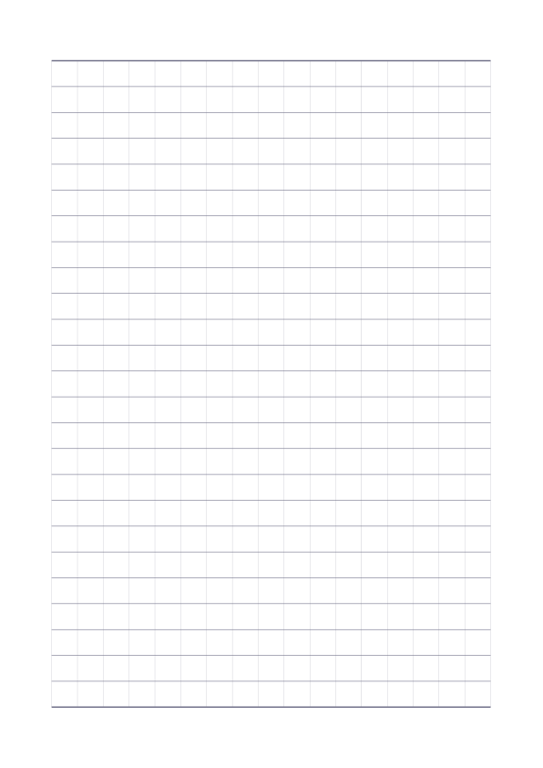
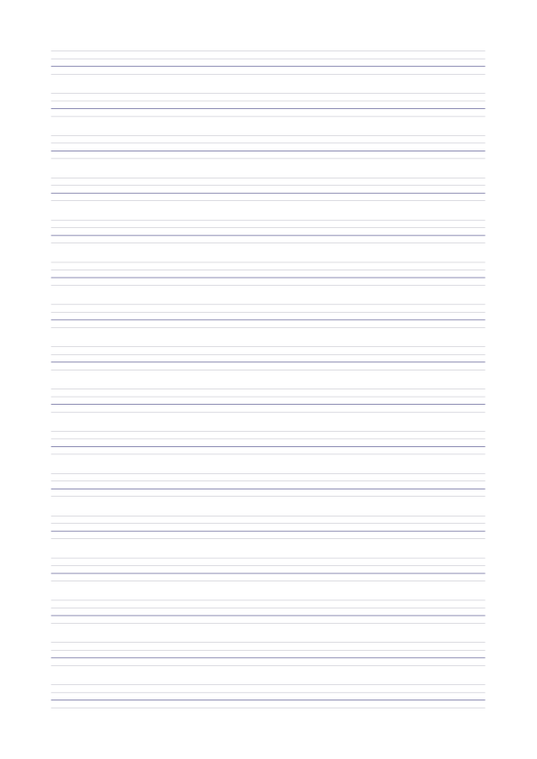

<h1 align="center">书写纸</h1>

<p align="center">
  <a href="../examples/writing-paper/writing-paper-lined.pdf"></a>
  <a href="../examples/writing-paper/writing-paper-grid.pdf"></a>
  <a href="../examples/writing-paper/writing-paper-english.pdf"></a>
</p>

书写纸提供横条、正方格和英文四线三格三种 A4 竖向打印版式。横条纸适合词语抄写、短句练习和日常记录；
方格纸适合数字书写、竖式计算和简单图形练习；英文四线三格纸帮助孩子练习字母和单词的书写位置。
家里临时需要练习纸、课堂上需要统一发放空白练习页时，打印所需份数即可。

不用自己画线或调整文档版式，选择纸张类型就能生成一页 PDF。
三种纸张都有默认设置，也可以根据练习需要调整行数、分栏或方格大小。

<p align="center">
  示例 PDF 文件：<a href="../examples/writing-paper/writing-paper-lined.pdf">横条书写纸</a> · <a href="../examples/writing-paper/writing-paper-grid.pdf">正方格纸</a> · <a href="../examples/writing-paper/writing-paper-english.pdf">英文四线三格纸</a>
</p>

每份示例均为一页，可直接下载打印。

## 快速开始

只需选择纸张类型：

```bash
namishu-printables writing-paper lined
namishu-printables writing-paper grid
namishu-printables writing-paper english
```

依次生成 `writing-paper-lined.pdf`、`writing-paper-grid.pdf`、`writing-paper-english.pdf`，
保存到运行命令的当前目录。每条命令生成一个单页 PDF，完成后显示保存位置。
同名文件会在生成成功后替换；需要保留多份时，可以用 `-o` 指定不同文件名。

三种纸张的上下左右页边距均设为 20 毫米，默认布局水平、垂直居中。
方格纸只绘制完整方格，剩余空间均匀分配到两侧，因此实际留白可能略大。

## 其他命令

横条纸和英文纸可以分成两栏或三栏，适合把短词、单词练习分栏书写：

```bash
namishu-printables writing-paper lined --columns 2
namishu-printables writing-paper english --columns 3
```

横条纸默认 20 行。如果希望行距更紧凑，可以增加行数：

```bash
namishu-printables writing-paper lined --rows 26
```

方格纸默认边长为 10 毫米，也可以改为更小的方格：

```bash
namishu-printables writing-paper grid --cell-size 8
```

保存到指定位置：

```bash
namishu-printables writing-paper grid --cell-size 8 -o paper/grid.pdf
```

相对路径以当前目录为准，不存在的输出目录会自动创建。

## 命令行选项

| 类型 | 选项 | 用途 | 默认值与范围 |
| --- | --- | --- | --- |
| 横条纸 `lined` | `--rows` | 书写行数 | 默认 20，允许 1～26 |
| 横条纸 `lined` | `--columns` | 书写栏数 | 默认 1，允许 1～3 |
| 方格纸 `grid` | `--cell-size` | 方格边长，单位为毫米 | 默认 10，允许 5～20，支持小数 |
| 英文纸 `english` | `--columns` | 书写栏数 | 默认 1，允许 1～3 |
| 全部类型 | `--config PATH` | 使用自定义 YAML 配置 | 内置设置 |
| 全部类型 | `-o, --output PATH` | PDF 保存路径 | 当前目录下对应类型的文件名 |
| 全部类型 | `--help` | 查看帮助 | |

横条纸的行数指书写区间数，20 行对应 21 条横线。方格纸根据边长自动计算行列数。
英文纸默认 16 组四线三格，每组总高 9 毫米，第三条线加重。

`--config` 和 `-o` 可放在纸张类型前或后，但须位于 `writing-paper` 后。
查看版本可运行 `namishu-printables writing-paper --version`。

## 自定义版式

只需填写想修改的设置。比如将以下内容保存为 `design.yaml`，让横条纸默认使用 26 行：

```yaml
parameters:
  lined:
    rows: {default: 26}
```

```bash
namishu-printables writing-paper lined --config design.yaml
```

未填写的设置保留默认值。下载[完整示例配置](../examples/writing-paper/design.yaml)，
可以查看和修改纸张尺寸、页边距、线条颜色及粗细。

| 设置 | 修改位置 |
| --- | --- |
| 纸张尺寸与页边距 | `layout`，单位为毫米 |
| 行数、栏数、格子尺寸的默认值与范围 | `parameters` 下对应的纸张类型 |
| 横条纸与英文纸的栏间距 | 对应类型的 `layout.column_gap_mm` |
| 英文四线三格的组数与组高 | `english.layout.groups` 和 `group_height_mm` |
| 方格纸的对齐方式 | `grid.layout.horizontal_alignment` 和 `vertical_alignment`，默认 `center` |
| 横线、竖线和首尾边界线 | 对应类型的 `style`，线宽单位为磅，颜色使用 `"#RRGGBB"` |

默认最多三栏。需要更多栏时，先在配置中提高对应类型的 `columns.max`，再指定栏数。例如：

```yaml
parameters:
  lined:
    columns: {max: 4}
```

```bash
namishu-printables writing-paper lined --config design.yaml --columns 4
```

英文纸同样通过 `parameters.english.columns.max` 调整上限。
设置仍须满足页面可用空间；无效设置会报错，并保留已有 PDF。
